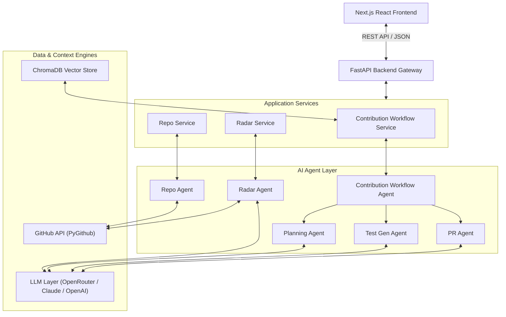
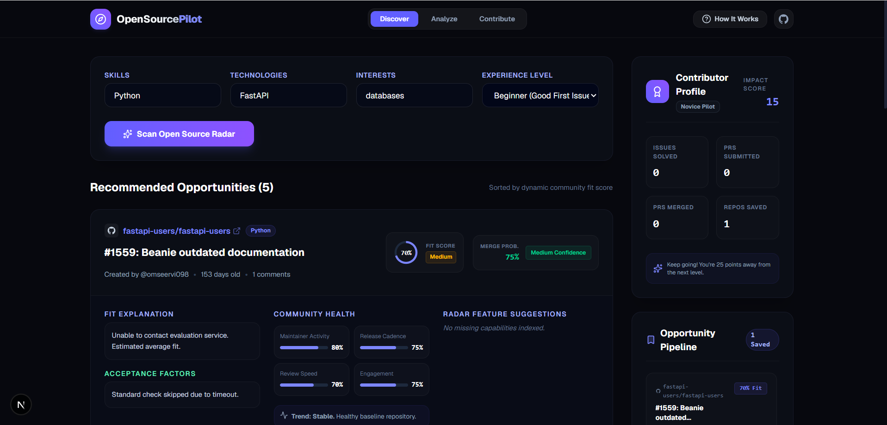
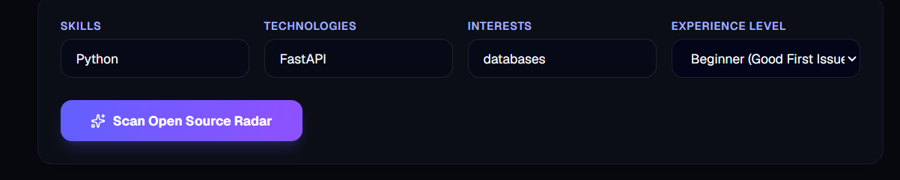
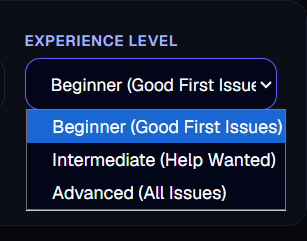
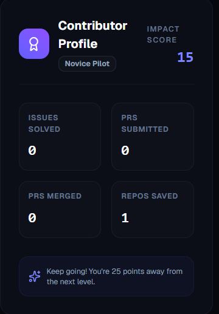
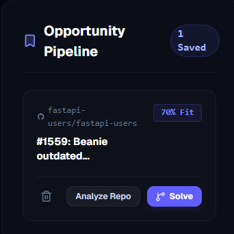
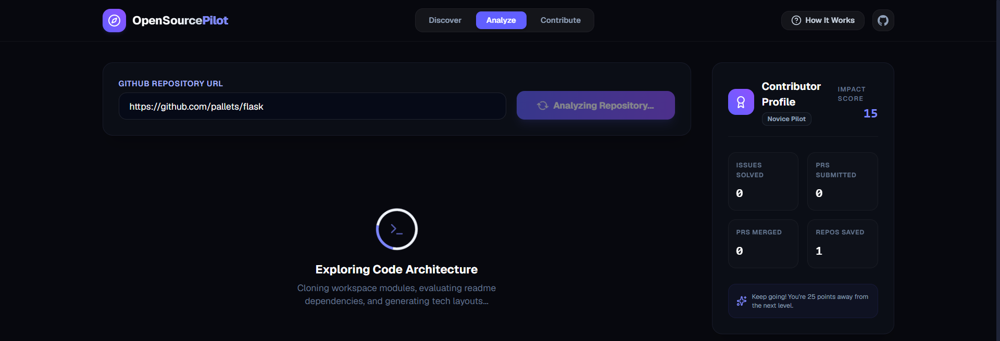
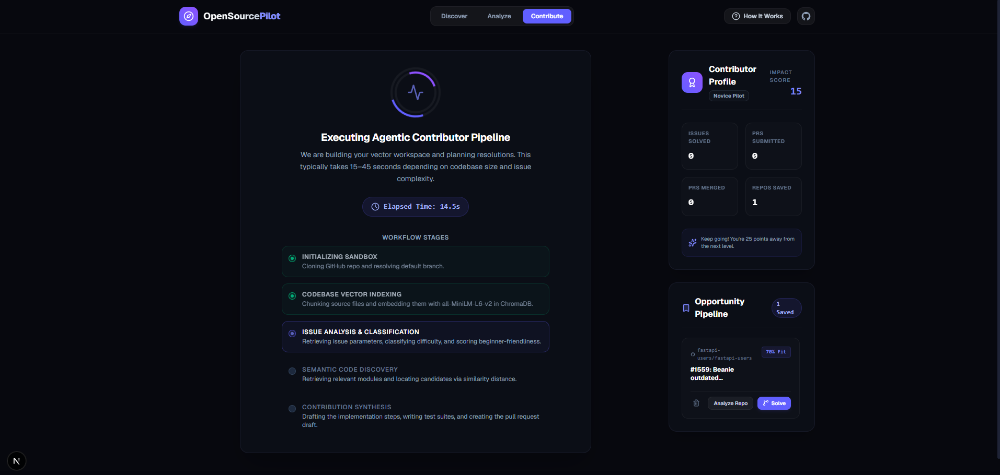

# OpenSourcePilot ✈️

The complete AI-powered open-source contribution platform. OpenSourcePilot helps developers discover the right issues, analyze codebases, plan solutions, generate test suites, and draft pull requests in one unified workflow.


---

### 🌐 Live Platform

* **Web Client:** [https://open-source-pilot.vercel.app/](https://open-source-pilot.vercel.app/)
* **Interactive API Docs:** [https://web-production-5369f.up.railway.app/docs](https://web-production-5369f.up.railway.app/docs)
* **GitHub Repository:** [https://github.com/coderleeon/OpenSource-Pilot](https://github.com/coderleeon/OpenSource-Pilot)

---

## 🧭 The Contributor Journey

OpenSourcePilot bridges the gap between searching for issues and writing pull requests. It organizes the contribution lifecycle into a logical, three-phase flow:

```
    ┌─────────────────────────┐      ┌─────────────────────────┐      ┌─────────────────────────┐
    │     1. DISCOVER         │ ───> │       2. ANALYZE        │ ───> │      3. CONTRIBUTE      │
    │  Open Source Radar      │      │   Repository Insights   │      │    AI-Guided Coding     │
    └─────────────────────────┘      └─────────────────────────┘      └─────────────────────────┘
```

1. **Discover (Open Source Radar):** Scan the open-source ecosystem for issues matching your skills, experience, and interests. Assess community health, merge confidence, and contributor fit before starting.
2. **Analyze (Codebase Exploration):** Understand the target repository's internal modules, structure tree, README conventions, and missing capability areas.
3. **Contribute (Solution & PR Drafts):** Generate target-relevant files lists, step-by-step solution drafts, unit/integration test suites, and review-ready pull requests.

---

## ⚡ Core Capabilities

### 📡 Phase 5: Open Source Radar
Search and evaluate GitHub repositories to find high-value open-source opportunities tailored to you.
* **Dynamic Contributor Fit Scoring:** Grade issue compatibility (0-100) and learning return based on user profile.
* **Merge Probability Engine:** Assess the likelihood of PR acceptance based on maintainer turnaround and issue history.
* **Repository Health Analytics:** Track community metrics, release frequency, and open issue trends.
* **Missing Feature Detection:** Receive LLM-generated feature suggestions to pitch to project maintainers.
* **Local Saved Pipeline:** Track and manage saved contribution targets locally.

### 🔍 Repository Intelligence & Semantic Search
Parse and index codebases to locate relevant segments without manual digging.
* **Structure & Stack Analysis:** Extract codebase directory structures and auto-detect primary languages and framework stacks.
* **ChromaDB Vector Indexing:** Create code-snippet embeddings using `sentence-transformers` for instant code context lookup.
* **Semantic Context Retrieval:** Match user query descriptions directly with relevant source files.

### 🛠️ Solution Planning & Auto-Testing
Go from understanding an issue to a complete contribution draft.
* **Actionable Contribution Plans:** Auto-generate root-cause hypotheses and sequential step-by-step implementation lists.
* **Multi-Language Test Generators:** Generate unit and integration test boilerplate for `pytest`, `Jest`, `JUnit`, `Go testing`, and `Rust testing`.
* **PR Draft Synthesis:** Formulate pull request summaries, Conventional Commits titles, and reviewer checklists.

---

## 📐 Architecture

OpenSourcePilot separates orchestration, scheduling, and AI agent execution layers for testability and scaling:



---

## 🖼️ Application Interfaces

### 1. Open Source Radar (Discover)
Input developer profiles and get suited contribution listings.


### 2. Tailored Search & Experience Filters
Refine listings by skill keywords and contribution ease levels.



### 3. Contributor Fit & Health Visualizers
Understand repository health and merge probability indicators.



### 4. Repository Structure Analyzer
Explore directory trees, tech stacks, and missing feature recommendations.


### 5. AI Code Synthesis & PR Drafter
Plan changes, build integration tests, and output complete Pull Request descriptions.


---

## 🛠️ Tech Stack

* **Frontend:** Next.js (TypeScript, Tailwind CSS, Lucide icons)
* **Backend:** FastAPI, Uvicorn, Python 3.12+
* **Semantic Search:** ChromaDB, `sentence-transformers` (`all-MiniLM-L6-v2` embeddings)
* **AI Engine:** OpenRouter SDK (Defaulting to Anthropic Claude 3.5 Haiku)
* **GitHub Integration:** PyGithub, GitPython
* **Testing:** Pytest

---

## 🚀 Quick Start

### 1. Clone & Set Up Directory
```bash
git clone https://github.com/coderleeon/OpenSourcePilot.git
cd OpenSourcePilot
```

### 2. Configure Environment
Create a `.env` file in the root directory:
```env
OPENROUTER_API_KEY=your_openrouter_api_key
GITHUB_TOKEN=your_github_personal_access_token
LLM_PROVIDER=openrouter
OPENROUTER_MODEL=anthropic/claude-3.5-haiku
```

### 3. Run Backend (Uvicorn)
```bash
# Set up virtual environment
python -m venv .venv
.venv\Scripts\activate   # Windows
source .venv/bin/activate # macOS/Linux

# Install dependencies and start server
pip install -r requirements.txt
uvicorn app.main:app --reload
```
*API docs will be available at:* `http://localhost:8000/docs`

### 4. Run Frontend Client
```bash
cd frontend
npm install
npm run dev
```
*Frontend interface will be available at:* `http://localhost:3000`

### 5. Run Verification Tests
```bash
pytest -v
```

---

## 🔌 API Endpoints Reference

### Open Source Radar (Phase 5)
* `POST /api/v1/radar/discover` - Scan for suitable issues based on skills, tech, interest, and experience level.
* `POST /api/v1/radar/repo-health` - Evaluate repository health scores, velocity, and active community trends.
* `POST /api/v1/radar/missing-features` - Fetch missing capability suggestions for a target repository.

### Repository Indexing
* `POST /api/v1/repo/analyze` - Clones a repository, parses structure, and indexes files into vector storage.
* `POST /api/v1/search/code` - Query code snippets semantically.

### Issue Analysis
* `POST /api/v1/issue/list` - List open issues for a repository.
* `POST /api/v1/issue/analyze` - Retrieve specific issue details and classify type/difficulty.
* `POST /api/v1/issue/complete-workflow` - Execute complete synthesis workflow (Analyze ➔ Plan ➔ Test ➔ PR).

---

## 🗺️ Roadmap & Release History

### **Phase 5 (Shipped - Current)**
- [x] **Open Source Radar:** Match issues dynamically based on dev profile.
- [x] **Merge Confidence Estimator:** Predict PR merge probability.
- [x] **Health Audits:** Analyze repo release frequency and maintainer activity.
- [x] **Missing Capability Detectors:** Suggest README optimizations and missing feature hooks.
- [x] **Visual Dashboard:** Redesigned Next.js visual suite with localized saved pipelines.

### **Phase 4 & Prior**
- [x] Semantic vector retrieval using ChromaDB.
- [x] Dynamic test script generators for JavaScript, Python, Rust, and Go.
- [x] Contextual Conventional Commit PR drafting.
- [x] Dockerization and multi-cloud configurations (Railway, Vercel).

---

## 👤 Author & Contributors

Developed and maintained by **Leeon John**. 

* **Twitter:** [@LeeonJohn_](https://x.com/LeeonJohn_)
* **LinkedIn:** [Leeon John Profile](https://www.linkedin.com/in/leeon-john-14172a159/)
* **GitHub:** [@coderleeon](https://github.com/coderleeon)
